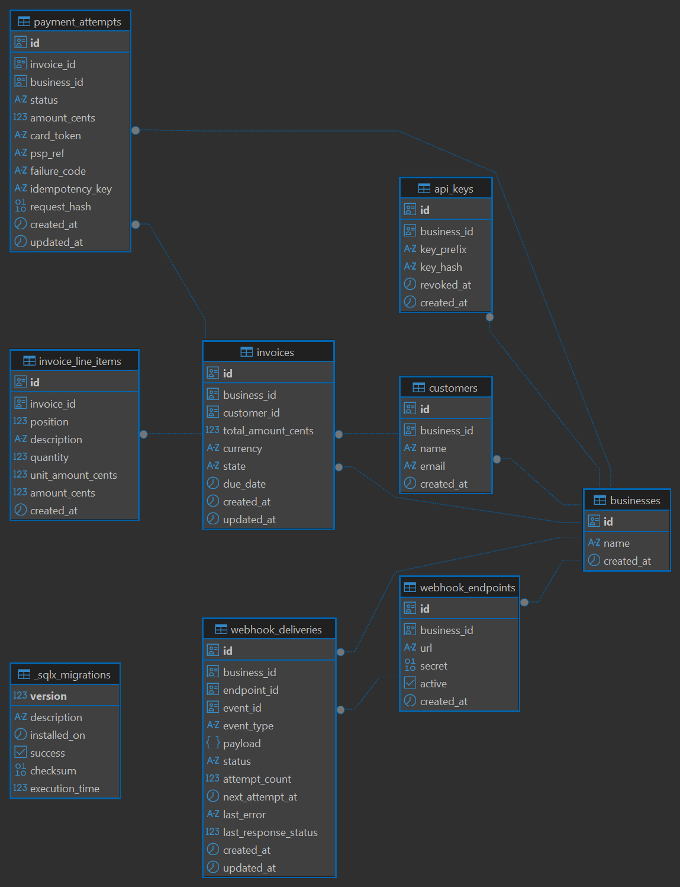
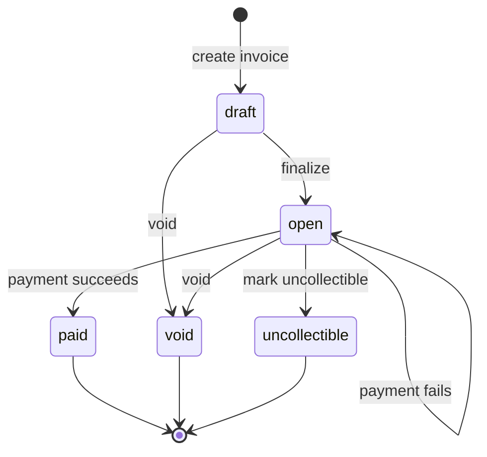

# DESIGN.md

## 1. Data Model

```
businesses ──< api_keys
businesses ──< customers ──< invoices ──< invoice_line_items
                              invoices ──< payment_attempts
businesses ──< webhook_endpoints ──< webhook_deliveries
```



### 1.1 businesses

Stores the businesses (tenants) using the system.

| Field | Description |
|---|---|
| `id` | Unique business ID |
| `name` | Business name |
| `created_at` | Time the business was created |

**Why it's needed:** every other table belongs to a business. This is what keeps one business's data separate from another's.

### 1.2 api_keys

Stores API keys used to authenticate requests.

| Field | Description |
|---|---|
| `id` | Unique API key ID |
| `business_id` | Business that owns the key |
| `key_prefix` | Visible prefix used to look the key up (unique, indexed) |
| `key_hash` | SHA-256 hash of the key — never the plaintext key |
| `revoked_at` | Time the key was revoked, if it has been |
| `created_at` | Time the key was created |

**Why it's needed:** a business can have multiple keys, so a leaked key can be revoked on its own without disabling the others. Only the hash is stored; the plaintext key is shown once, at creation, and never persisted.

### 1.3 customers

Stores customers belonging to a business.

| Field | Description |
|---|---|
| `id` | Unique customer ID |
| `business_id` | Business that owns the customer |
| `name` | Customer name |
| `email` | Customer email |
| `created_at` | Time the customer was created |

**Constraint:** `UNIQUE (business_id, email)` — the same email can't be reused twice within one business, but two different businesses can each have a customer with that same email.

**Index:** `(business_id, created_at DESC)` — for listing a business's most recent customers.

### 1.4 invoices

Stores invoices created for customers.

| Field | Description |
|---|---|
| `id` | Unique invoice ID |
| `business_id` | Business that owns the invoice |
| `customer_id` | Customer who should pay it |
| `total_amount_cents` | Total invoice amount, in cents |
| `currency` | Currency, e.g. `USD` |
| `state` | Current invoice state — see section 2 |
| `due_date` | Optional payment due date |
| `created_at` | Time the invoice was created |
| `updated_at` | Time the invoice was last updated |

The amount is stored in cents (`$25.50` → `2550`) instead of a float, so money math never hits rounding error. Two constraints make the invalid states unrepresentable rather than just app-rejected:

- `CHECK (total_amount_cents >= 0)`
- `CHECK (state IN ('draft', 'open', 'paid', 'void', 'uncollectible'))`

**Index:** `(business_id, state, created_at DESC)` — serves "all open invoices for a business" and "latest paid invoices" directly.

### 1.5 invoice_line_items

Stores the individual line items inside an invoice.

| Field | Description |
|---|---|
| `id` | Unique line-item ID |
| `invoice_id` | Invoice the item belongs to |
| `position` | Order of the item within the invoice |
| `description` | Description of the item |
| `quantity` | Number of units |
| `unit_amount_cents` | Price per unit, in cents |
| `amount_cents` | Total for the line (`quantity × unit_amount_cents`) |

`amount_cents` is a Postgres generated column, not app-computed:

```sql
amount_cents BIGINT GENERATED ALWAYS AS (quantity * unit_amount_cents) STORED
```

So a line item whose total disagrees with its own quantity × price simply can't exist in the database.

**Indexes:** `invoice_id`, and `UNIQUE (invoice_id, position)` so two line items on the same invoice can never claim the same position.

### 1.6 payment_attempts

Stores every attempt to pay an invoice.

| Field | Description |
|---|---|
| `id` | Unique payment-attempt ID |
| `invoice_id` | Invoice being paid |
| `business_id` | Business that owns the payment |
| `status` | `pending`, `succeeded`, or `failed` |
| `amount_cents` | Amount sent to the PSP |
| `card_token` | Mock payment token |
| `psp_ref` | Reference returned by the mock PSP |
| `failure_code` | Reason for a failed payment |
| `idempotency_key` | Key supplied by the client |
| `request_hash` | Hash of the payment request, used to detect key reuse with a different body |
| `created_at` | Time the attempt was created |
| `updated_at` | Time the attempt was last updated |

This table does two jobs at once: it's the payment ledger, and it's the idempotency store. If a client sends the same request twice with the same idempotency key, the service returns the original result instead of charging the invoice again — and `request_hash` means a *different* request reusing the same key is rejected instead of silently returning a stale result. Full failure-mode walkthrough in section 3.

**Constraint:** `UNIQUE (business_id, idempotency_key)` — an idempotency key can't be reused by the same business.

**Also:** two partial unique indexes on `invoice_id` (`WHERE status = 'pending'`, `WHERE status = 'succeeded'`) so an invoice can never have two attempts racing at once or two successful charges — see section 3(a).

**Index:** `(invoice_id, created_at DESC)` — payment history for an invoice.

### 1.7 webhook_endpoints

Stores the URLs where a business wants to receive webhook events.

| Field | Description |
|---|---|
| `id` | Unique endpoint ID |
| `business_id` | Business that owns the endpoint |
| `url` | URL events should be sent to |
| `secret` | Secret used to sign outgoing webhook requests |
| `active` | Whether the endpoint is enabled |
| `created_at` | Time the endpoint was created |

`secret` is stored raw, not hashed — the delivery worker needs the actual value to compute a signature, not just to compare one.

### 1.8 webhook_deliveries

Stores webhook events queued for delivery.

| Field | Description |
|---|---|
| `id` | Unique delivery ID |
| `business_id` | Business that owns the event |
| `endpoint_id` | Endpoint receiving the event |
| `event_id` | Unique ID of the event |
| `event_type` | e.g. `invoice.paid` |
| `payload` | JSON payload sent to the endpoint |
| `status` | Current delivery status |
| `attempt_count` | Number of delivery attempts so far |
| `next_attempt_at` | When the next retry is due |
| `last_error` | Last error message, if any |
| `last_response_status` | Last HTTP response status received |
| `created_at` | Time the delivery was created |
| `updated_at` | Time the delivery was last updated |

This table is a **transactional outbox**, and it's what makes webhook retries reliable — without it, a process restart could silently lose a pending event. When an invoice is paid, the invoice update and the webhook delivery row are written in the *same* database transaction; a separate background worker then sends it:

```
invoice becomes paid → save invoice update → save delivery row (same tx)
    → background worker sends webhook → retry on failure
```

The payload is frozen at enqueue time, so if the invoice changes later, a webhook already sitting in the queue doesn't retroactively change what it reports.

**Index:** `next_attempt_at` (partial, `WHERE status = 'pending'`) — this is what lets the worker cheaply find deliveries that are due. Also `(business_id, created_at DESC)` for the delivery-history API.

### 1.9 Primary key strategy

Every table uses `id UUID PRIMARY KEY DEFAULT gen_random_uuid()`. UUIDs are hard to guess, don't reveal record counts or ordering, can be generated by the application before an insert (useful for the outbox pattern above), and are safe to hand out in URLs and webhook payloads. The trade-off is index locality/size versus a `BIGSERIAL`. For this scope — a billing system where IDs cross tenant boundaries and end up in third-party webhook payloads — unguessability wins.

### 1.10 Why there's no separate `payments` table

`payment_attempts` already carries amount, status, PSP reference, failure info, idempotency key, and history — a `payments` table would just duplicate that and add a sync problem between the two. If the system later needs refunds, partial payments, or multiple successful payments per invoice, a real payment ledger becomes worth adding. Out of scope here.

### 1.11 Indexes summary

| Table | Important indexes |
|---|---|
| `businesses` | Primary key only |
| `api_keys` | Unique `key_prefix`, `business_id` |
| `customers` | Unique `(business_id, email)`, `(business_id, created_at DESC)` |
| `invoices` | `(business_id, state, created_at DESC)` |
| `invoice_line_items` | `invoice_id`, unique `(invoice_id, position)` |
| `payment_attempts` | Unique `(business_id, idempotency_key)`, two partial-unique on `invoice_id`, `(invoice_id, created_at DESC)` |
| `webhook_endpoints` | `business_id` |
| `webhook_deliveries` | Pending deliveries by `next_attempt_at`, `(business_id, created_at DESC)` |

### 1.12 What happens at 100x scale

**Large invoice/payment tables.** Queries filtering by `business_id` get slower as the tables grow. Fix path: better/partial indexes first, then partitioning (`business_id` hash or `created_at` range), then archiving old records.

**The webhook worker polls the database.** Today it's `SELECT * FROM webhook_deliveries WHERE status='pending' AND next_attempt_at <= now()` every 2 seconds — fine at this scale, but constant polling doesn't scale and only tolerates one worker safely (no `FOR UPDATE SKIP LOCKED` claim step yet). At 100x, a real queue (SQS/Kafka) replaces the poll, and multiple workers can consume it concurrently.

A database-backed worker is the right call for this assignment specifically because it's simpler to run and demonstrate end-to-end without standing up extra infrastructure.

## 2. Invoice State Machine

An invoice moves through a fixed set of states. Each state has a clear meaning, and some states cannot be changed once reached.

### 2.1 Invoice states

| State | Meaning |
|---|---|
| `draft` | The invoice is being created or edited. It cannot be paid yet. |
| `open` | The invoice is finalized and can now be paid. |
| `paid` | The invoice has been paid successfully. |
| `void` | The invoice was cancelled because it was never actually owed. |
| `uncollectible` | The invoice was owed, but the business has given up trying to collect it. |

### 2.2 Allowed transitions



A failed payment does **not** move the invoice anywhere — it stays `open` so the business can try again. Only the `payment_attempts` row for that attempt becomes `failed`; the invoice itself is untouched. `open → open` is drawn above deliberately, not omitted, so a failed payment doesn't get misread as a state transition of the invoice.

**Terminal states:** `paid`, `void`, `uncollectible`. Once an invoice reaches one of these, nothing moves it to another state — there is no transition out.

### 2.3 Why there are no reverse transitions

This is intentional, not an oversight:

- `void` means the invoice should never have been charged in the first place.
- `uncollectible` means the invoice was legitimately owed, but the business has stopped trying to collect (e.g. after repeated failed payment attempts).
- `paid` means the payment succeeded.

These are three different outcomes, not one "cancelled" bucket, and none of them is meant to be undone through this API. If a business needs to charge the same customer again, it creates a new invoice.

### 2.4 How invalid transitions are handled

Two checks, not one — both have to pass:

1. **API level.** The handler checks the invoice's current state before attempting a transition. Trying to finalize an already-paid invoice:

   ```
   POST /invoices/{id}/finalize  (invoice is already 'paid')
       → 409 Conflict
       → "cannot finalize an invoice in state 'paid'"
   ```

2. **Database level.** The `UPDATE` itself is a status-conditional compare-and-swap, not a blind write:

   ```sql
   UPDATE invoices
   SET state = 'open'
   WHERE id = $1
     AND state = 'draft';
   ```

   If another request already changed the invoice between the API check and this `UPDATE`, zero rows match and the update is a no-op. The service reads that (`rows_affected() == 0`) as a conflict and returns `409` — never a silent no-op, never a corrupted state. This is what keeps two concurrent requests from both thinking they successfully transitioned the same invoice.

## 3. Payment Correctness & Failure Modes


**(a) Two clients `POST /pay` for the same invoice at the same instant.**
`payment_attempts` has two partial unique indexes: one `WHERE status = 'pending'` and one `WHERE status = 'succeeded'`, both on `invoice_id`. The handler's first DB write is `INSERT ... status='pending'`, before the PSP is ever called. Of N concurrent inserts, Postgres lets exactly one commit; the rest fail the unique constraint immediately and are mapped to `409 Conflict` — they never reach the PSP at all. The winner proceeds, calls the PSP, and on success flips the invoice `open → paid` with a status-conditional `UPDATE`. Verified directly: `tests/concurrent_payment_test.rs` fires 15 concurrent requests and asserts exactly one `200`, the rest `409`, and exactly one `succeeded` row.

**(b) The mock PSP times out (`tok_timeout`, 30s).**
The invoice service's own HTTP client has a 5-second timeout on the PSP call — well under the 30s the mock sleeps. When that fires, the endpoint returns `202 Accepted` immediately with the payment attempt still `status: "pending"`; the invoice stays `open`. We deliberately never treat an unresolved call as success or failure, because we genuinely don't know which it is. **Honest gap:** the caller currently finds out the eventual result by re-sending the identical request (same `Idempotency-Key` + body) — that hits the idempotency-replay path and returns the attempt's current status without a second PSP call, so it's a safe thing to poll with. But nothing in this build ever *transitions* that pending attempt out of `pending` after the fact — there's no reconciliation job that goes back and asks the PSP "what actually happened to this charge?" A production version needs one (see section 7).

**(c) The PSP returns success but the service crashes before persisting it.**
The row is already `pending` (inserted before the PSP call). If the process dies between receiving the PSP's success response and committing `mark_succeeded`, that row is stuck `pending` — same observable state as (b). Crucially, **the customer is not charged twice on retry**: a retry with the *same* `Idempotency-Key` lands on the existing pending row and returns "still pending" without calling the PSP again (a *new* idempotency key would be rejected differently — see (e)). What it does leave is a reconciliation gap identical to (b): the PSP may hold a successful charge that this system has no record of. Because `mark_succeeded` is itself a conditional `UPDATE ... WHERE status = 'pending'`, it's safe to call from a reconciliation job after the fact with no risk of double-processing.

**(d) An idempotency key is reused with a different request body.**
The key is fingerprinted by hashing `(invoice_id, card_token)` at write time. A replay with the same key but a different fingerprint is rejected with `409 idempotency_key_reuse` rather than silently returning the old result for a request that isn't actually the same request. Covered by `tests/idempotency_test.rs`.

**(e) An invoice in `paid` state receives another `POST /pay`.**
Two cases, both correct: the *same* idempotency key as the original payment → idempotent replay, returns the original `200 succeeded` response, no new attempt, no new charge. Any *other* idempotency key → the handler's state check runs (`current != Open`) and returns `409 Conflict` before a `payment_attempts` row is even created.

## 4. Webhook Design

**Signing:** every outbound webhook carries a signature the receiver can use to confirm it really came from us.

- **What's signed:** the current unix timestamp, joined to the JSON body with a dot — `"{timestamp}.{body}"` — hashed with HMAC-SHA256 using the endpoint's secret.
- **How it's sent:** `X-Webhook-Signature: t=<timestamp>,v1=<hex-encoded hash>` (this is Stripe's scheme).
- **How the receiver checks it:** recompute the same HMAC from the timestamp + body it received and the secret it was given at registration, and compare it to `v1`.
- **Why the timestamp is signed too, not just the body:** it's what makes replay protection possible. The receiver also rejects any signature whose `t` is too old (outside a small tolerance window, e.g. a few minutes) — so even a captured, still-valid-looking request can't be replayed later.
- **The secret itself:** a 32-byte random value, one per endpoint, shown once at registration and stored raw in the database (not hashed) — the delivery worker needs the real value to compute a signature, not just to compare one.

**Retry policy:** 30s, 2m, 10m, 30m, 2h, 6h — 6 attempts, ~9h11m total budget — then the delivery is marked `exhausted` and stops being retried.

**Exhausted deliveries:** stay in `webhook_deliveries` with `status='exhausted'`, `last_error`, and `last_response_status` intact, queryable via `GET /webhooks/deliveries`. There's no automatic redelivery endpoint in this build (cut — see section 6); today a business reconciles by re-reading current state directly (`GET /invoices/{id}`) rather than replaying the original event.

**Why delivery is decoupled from the request path, and how:** a request handler's only interaction with webhooks is `db::webhooks::enqueue`, a plain `INSERT` per active endpoint — no network call, so a slow or dead receiver can never make an API response hang. A separate background task (spawned once at server startup, polling every 2 seconds) is the only code that ever makes the outbound HTTP call. This is a table-as-outbox pattern, chosen over firing the webhook inline with `tokio::spawn` because it survives a process restart — an enqueued-but-undelivered event is still in the table, not lost in a dropped in-memory task.

## 5. API Key Model

**Format:** `sk_live_<48 hex chars>` — 192 bits of randomness. Generated out-of-band by an operator CLI (`create-api-key`), not a public endpoint, so "create a business" is never part of the unauthenticated attack surface.

**Storage:** only a SHA-256 hash is persisted. SHA-256, not bcrypt/argon2, is the right call here specifically because the input is already a 192-bit random secret, not a low-entropy human password — there's no offline brute-force risk for a slow KDF to defend against, and hashing every request's key on a fast general-purpose hash keeps auth cheap. The first 8 hex chars are stored again, unhashed, as `key_prefix`, purely so lookup is an indexed equality match instead of hashing and scanning every row on every request.

**Transmission:** `Authorization: Bearer sk_live_...`. Chosen over a bespoke `X-API-Key` header because it's the slot most HTTP libraries, proxies, and log-scrubbing tools already know to redact by convention.

**Rotation & revocation:** revocation is `UPDATE api_keys SET revoked_at = now()`; a revoked key stops matching on its very next use (no caching to add delay). This is currently a manual SQL operation, not an HTTP endpoint or CLI flag — a deliberate cut for this scope (see section 6), but it means zero-downtime rotation (issue a second key, migrate traffic, then revoke the first) isn't fully self-serve today since the only key-issuing tool bundles it with creating a brand-new business.

**Blast radius if leaked:** a key has no finer-grained scope than "full read/write on this business" — it can read/create customers and invoices, attempt payments, and register webhook endpoints (which could redirect a business's event stream to an attacker-controlled URL). There's no per-key permission split (e.g. read-only keys) in this build.

## 6. What You Cut and Why

- **Payment reconciliation job.** The most important cut. A `pending` attempt left by a timeout or a mid-flight crash is never actively resolved — see 3(b)/3(c). Time-boxed out; would be the first thing added next.
- **API key rotation/revocation endpoints.** Manual SQL only. Small surface, but real — named explicitly here rather than left silent.
- **Webhook manual redelivery.** No `POST /webhooks/deliveries/{id}/retry`; a business reconciles by re-reading current invoice state instead.
- **Pagination on list endpoints.** `GET /customers`, `GET /invoices`, `GET /webhooks/deliveries` return everything (deliveries capped at 200) rather than a cursor. Fine at this scale, not at 100x.
- **Refunds/partial payments, multi-currency, subscriptions, tax.** Explicitly out of scope per the assignment; not built.
- **Production-grade rate limiting.** Out of scope per the assignment; not built.

## 7. Production Readiness Gap

If this shipped tomorrow, the top three things missing:

1. **The reconciliation job** from section 3/6 — without it, a real PSP outage leaves real charges in an unknown state indefinitely, which is the single scariest gap in a billing system.
2. **Observability.** Logging today is `tracing` to stdout only — no metrics, no dashboards, no alerting on PSP error rate or webhook delivery failure rate. In production you'd want to know *before* a customer complains that the PSP is timing out.
3. **Multi-instance safety for the webhook worker.** It assumes exactly one running instance (documented in code); running two would double-send webhooks since there's no claim step (`FOR UPDATE SKIP LOCKED`) around `fetch_due`. Fine for a single-container deployment, not for a horizontally-scaled one.

Also notably absent:

- **Encryption at rest for sensitive columns**, most importantly `webhook_endpoints.secret`. That secret is intentionally stored raw, not hashed, because the delivery worker needs the real value to compute the HMAC signature on every outgoing webhook (a one-way hash can't be signed with). That's a correct trade-off, but it means a full database compromise doesn't just leak data — it hands an attacker a usable signing key, letting them forge convincingly-signed fake webhook events (`invoice.paid`, etc.) against a business's real endpoint, not just read history. In production this column (and arguably request/PII-bearing columns generally) should be encrypted at rest with a key held outside the database — a KMS or secrets manager — so a raw DB dump alone isn't enough to sign anything; the attacker also needs the separate key.
- An audit log of API key usage/administrative actions.
- Any dunning process for chronically failing invoices beyond a manual `mark_uncollectible`.
